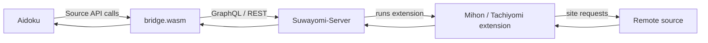

<p align="center">
  <a href="https://github.com/TaisenDev">
    
  </a>
</p>

<h1 align="center">aidoku-bridge-template</h1>

<p align="center">
  Generic <a href="https://aidoku.app">Aidoku</a> source bridge for <a href="https://github.com/Suwayomi/Suwayomi-Server">Suwayomi-Server</a>.
  <br>
  One reusable WASM binary, many Suwayomi sources.
</p>

<p align="center">
  <a href="https://github.com/TaisenDev/aidoku-bridge-template/releases"></a>
  <a href="https://github.com/TaisenDev/aidoku-bridge-template/commits"></a>
  <a href="https://github.com/TaisenDev/aidoku-bridge-template/issues"></a>
  <a href="https://github.com/TaisenDev/aidoku-bridge-template/stargazers"></a>
</p>

> [!NOTE]
> This repository is the **generic runtime**, not the package generator. If you only want ready-to-use `.aix` sources, go to [`aidoku-bridge-builder`](https://github.com/TaisenDev/aidoku-bridge-builder).

## Overview

`aidoku-bridge-template` is the reusable Rust/WASM part of the Aidoku Bridge project.

Its job is intentionally small: **translate Aidoku source requests into calls to a Suwayomi-Server instance**. Suwayomi does the heavy lifting — loading and running Mihon/Tachiyomi-compatible extensions, contacting the remote site, handling source-specific behavior, and exposing the resulting data through its API.

The bridge then adapts that data to the Aidoku source interface.



### The important idea

This project **does not implement one scraper per website**.

Instead, it reuses Suwayomi as the execution layer and keeps the Aidoku side generic. That means the same compiled `bridge.wasm` can represent many different sources; the generated `.aix` package only changes its metadata and runtime configuration.

> **No site scraping happens inside Aidoku.** The bridge talks to Suwayomi, and Suwayomi communicates with the actual source through its installed extension.

## What the bridge exposes

The generic source currently maps Aidoku functionality to Suwayomi operations:

| Aidoku feature | Suwayomi operation |
| --- | --- |
| Popular / Latest | `fetchSourceManga` with `POPULAR` / `LATEST` |
| Search | `fetchSourceManga` with `SEARCH` and translated `FilterChange` values |
| Search by `http(s)` URL | `addMangaFromUrl` |
| Manga details | `fetchMangaAndChapters` with `fetchManga: true` |
| Chapters | `fetchChapters` |
| Reader pages | `fetchChapterPages` → remote page URLs |
| Covers | `GET /api/v1/manga/{id}/thumbnail` |
| Dynamic filters | `source(id).filters` → Aidoku filter model |

For the current implementation, GraphQL is the primary Suwayomi interface and the REST thumbnail endpoint is used for covers. Suwayomi documents `/api/graphql` as its GraphQL API and its server is designed to run Mihon/Tachiyomi extensions. citeturn206971search1turn431769view1

## Repository structure

```text
.
├── src/
│   ├── lib.rs            # Aidoku source implementation
│   └── suwayomi.rs       # Suwayomi API transport and response models
├── res/
│   ├── source.json       # Per-source metadata
│   ├── settings.json     # Server / credential / source configuration
│   └── icon.png          # Source icon (128×128, opaque PNG)
└── ...
```

The Rust implementation is shared. The `res/` directory is the part that the builder customizes for each generated source package.

## Reusable binary model

The key design decision is that **one WASM binary serves every source**.

```text
                   ┌──────────────────────┐
                   │     bridge.wasm       │
                   │   generic Rust/WASM   │
                   └──────────┬───────────┘
                              │
                 ┌────────────┴────────────┐
                 │      package `res/`     │
                 ├─────────────────────────┤
                 │ source.json             │
                 │ settings.json           │
                 │ icon.png                │
                 └────────────┬────────────┘
                              │
                              ▼
                       `source.aix`
```

This keeps source-specific packaging separate from source execution logic. The builder repository is responsible for creating those per-source packages.

## Requirements

| Dependency | Purpose |
| --- | --- |
| [Suwayomi-Server](https://github.com/Suwayomi/Suwayomi-Server) ≥ 2.3 | Runs the compatible extensions and exposes the API consumed by the bridge |
| [Aidoku](https://aidoku.app) ≥ 0.7.0 | Installs and runs the generated `.aix` source |
| [Rust](https://www.rust-lang.org/) | Only required when changing or rebuilding the template |
| [`aidoku-cli`](https://github.com/Aidoku/aidoku-rs) | Packages and verifies the Aidoku source |

Suwayomi's current documentation describes the server as a reader backend that runs Mihon/Tachiyomi extensions, while `aidoku-rs` provides `aidoku-cli` for Aidoku source development. citeturn431769view1turn431769view0

## Build

You normally **do not need to build this repository yourself**. The builder consumes a ready `bridge.wasm` artifact.

When modifying the bridge logic:

```bash
rustup target add wasm32-unknown-unknown
cargo install --git https://github.com/Aidoku/aidoku-rs aidoku-cli

aidoku package .
aidoku verify package.aix
```

The resulting WASM/package can then be consumed by [`aidoku-bridge-builder`](https://github.com/TaisenDev/aidoku-bridge-builder).

## Source configuration

The generated Aidoku source uses the following runtime settings:

| Key | Required | Description |
| --- | --- | --- |
| `serverUrl` | Yes | Publicly reachable Suwayomi URL, e.g. `https://suwayomi.example.com` |
| `username` | Conditional | HTTP Basic Auth username when the server/proxy is protected |
| `password` | Conditional | HTTP Basic Auth password; accepts plaintext or builder-baked `obf1:` value (auto-decoded, fails closed on mismatch) |
| `sourceId` | Yes | Numeric Suwayomi source ID |

The builder pre-populates the source metadata and settings for every generated `.aix` package.

## Add-by-URL

All normal browsing, search, details, chapters, filters, covers, and reader flows work against stock Suwayomi.

The **add-by-URL** path additionally relies on Suwayomi's `addMangaFromUrl` mutation. In the current setup, that mutation is an additive server-side capability that resolves the URL, installs the required extension if necessary, fetches manga data, and adds the result to the library.

Without that server-side capability, only add-by-URL is unavailable; the rest of the bridge remains functional.

## Security model

The bridge is designed around a server-side architecture:

- Aidoku talks to your Suwayomi instance instead of directly implementing each website integration.
- Page URLs are returned by Suwayomi and consumed by Aidoku when reading.
- Credentials may be supplied through source settings; the builder can optionally bake them into generated packages (obfuscated as `obf1:`, decoded at runtime by `deobf` in `src/suwayomi.rs`).
- A baked password bound to a different server/username decodes to garbage and fails closed — retype the password after changing those fields.
- Never commit real credentials, proxy passwords, or private server URLs to source control.

> [!WARNING]
> If credentials are baked into a `.aix` package, anyone who obtains that package may be able to recover those credentials. Treat such packages as containing server access.

## Related repository

### [`aidoku-bridge-builder`](https://github.com/TaisenDev/aidoku-bridge-builder)

The builder is the automation layer that:

- discovers and installs Suwayomi extensions,
- updates them when new versions are available,
- generates per-source `res/` metadata,
- packages the shared `bridge.wasm` into `.aix` files,
- writes the Aidoku source index, and
- serves the resulting repository for Aidoku.

The builder uses this repository's compiled `bridge.wasm`; it does **not** contain another source implementation.

## Project links

| Resource | Link |
| --- | --- |
| Organization | [TaisenDev](https://github.com/TaisenDev) |
| Builder | [aidoku-bridge-builder](https://github.com/TaisenDev/aidoku-bridge-builder) |
| Template | [aidoku-bridge-template](https://github.com/TaisenDev/aidoku-bridge-template) |
| Suwayomi-Server | [Suwayomi/Suwayomi-Server](https://github.com/Suwayomi/Suwayomi-Server) |
| Aidoku | [aidoku.app](https://aidoku.app) |
| Aidoku Rust API | [Aidoku/aidoku-rs](https://github.com/Aidoku/aidoku-rs) |


<p align="center">
  <sub>Part of the <a href="https://github.com/TaisenDev/aidoku-bridge-builder">Aidoku Bridge</a> project.</sub>
</p>
